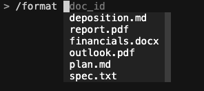

# `/slash-command`（MCP prompt）的执行流程

> 英文版见 [`slash-command-prompt-flow.md`](slash-command-prompt-flow.md)。两份文档内容对应一致。

输入 `/` 会触发**两条不同的流程（flow）**，和 `@` 完全对称（参见
[`at-mention-resource-flow.md`](at-mention-resource-flow.md)）。本文逐函数追踪每条流程，标注
`file:line`，最后列出当前实现里的 **bug**。

> **可信度图例（grounding legend）**
> - 🟢 **已验证（verified）** —— 对照仓库源码（`file:line`）、`.venv/` 里的 mcp SDK，
>   或本次会话内的无头探针（headless probe）实测。
> - 🟡 **行为相关（behavioral）** —— 取决于模型运行时的决策，不由代码固定。

一条"斜杠命令（slash command）"**就是**一个 **MCP prompt**（`@mcp.prompt`）：服务端
（server）发布带名字、带参数的消息模板（message template）；客户端（client）列出它们
（`prompts/list`）、用参数渲染（render）其中一个（`prompts/get`），再把返回的消息直接拼接
进对话。

## 两条流程速览

| | **流程 A —— 自动补全（autocomplete）** | **流程 B —— 渲染 + agent 循环** |
|---|---|---|
| 触发 | 你输入 `/`……（**不**按 Enter） | `/format plan.md` 然后按 **Enter** |
| 你看到什么 | 命令名 / 文档 id 的下拉框；参数名的灰字提示（ghost hint） | 模型的回答 |
| `list_prompts`（`prompts/list`） | **这里不调用** —— 读取**启动时填一次**的缓存 | 不调用 |
| `get_prompt`（`prompts/get`） | 完全不涉及 | **实时调用**一次，渲染模板 |
| 按键 / 提交时有服务端往返吗？ | **没有**（本地缓存） | **有**（`prompts/get` ×1） |

> ⚠️ **和 `@` 一样的常见误解：**"输入 `/` 会调用 `list_prompts`"。**并不会。**
> `UnifiedCompleter.get_completions` 是**同步（synchronous）**方法（`cli.py:52`），不能
> `await`，所以它只能过滤内存里的 prompt 缓存。`list_prompts` 在**启动时**跑一次（填这个
> 缓存）；提交时也**不会**再跑 —— 流程 B 只调用 `get_prompt`。

> 🔁 **与 `@` 的流程 B 对比：** 一次 `@` 提交会做**两次**实时 resource 读取
> （`list_docs` + `fetch_doc`）。一次 `/` 提交只做**一次**实时 prompt 渲染（`get_prompt`），
> **不读**任何 resource —— 文档 id 只是作为字符串被插值（interpolate）进模板；文档**内容**
> 是之后由模型通过 `read_doc_contents` 工具去取的。🟡

---

## 流程 A —— 自动补全（输入 `/`，不按 Enter）

### 前提：prompt 列表在启动时缓存一次
```
main.py → await cli.initialize()                       main.py:58  （定义见 core/cli.py:179）
  └─ await self.refresh_prompts()                      cli.py:181  （定义见 cli.py:190）
       self.prompts = await agent.list_prompts()       cli.py:192
                       └─ doc_client.list_prompts()    cli_chat.py:22
                            └─ session().list_prompts() → server  ← 流程 A 里唯一的 list_prompts 调用
       self.completer.update_prompts(self.prompts)     cli.py:193   ← 列表缓存进内存
       self.command_autosuggester = CommandAutoSuggest(self.prompts)  cli.py:194  ← 灰字提示的缓存
```
这是 `list_prompts` 唯一运行的时刻。会话期间**不再刷新**（`refresh_prompts` 只被
`initialize` 调用一次，`cli.py:181`）。

🟢 对运行中的 server 做探针 —— 被缓存的内容：
```
list_prompts() -> [ Prompt(name='format',
                           description='Rewrites the contents of the document in Markdown format.',
                           arguments=[ PromptArgument(name='doc_id',
                                                      description='Id of the document to format',
                                                      required=True) ]) ]
```

### 每次按键 —— **无**服务端调用。三个补全子阶段 + 一个灰字提示。

```
你按下 "/"（缓冲区为空）                                  键绑定  cli.py:125
  buffer.insert_text("/"); buffer.start_completion()         cli.py:129-130
        │
        ▼
UnifiedCompleter.get_completions(document)             cli.py:52   ← 同步（不能 await）
  text.startswith("/")                                 cli.py:70
        │
        ├─(A1) len(parts) <= 1 且 not endswith(" ")    cli.py:73    例如  "/fo"
        │        for prompt in self.prompts:           cli.py:76    ← 读缓存的 prompts
        │           if prompt.name.startswith(cmd_prefix):  cli.py:77
        │              yield Completion("/format", meta=描述)  cli.py:78-83
        │
        ├─(A2) len(parts) == 1 且 endswith(" ")        cli.py:86    例如  "/format "
        │        if cmd in self.prompt_dict:           cli.py:89
        │           for id in self.resources:          cli.py:90    ← 读缓存的 resources（list[str]）
        │              yield Completion(id)             cli.py:91-95   ← 列出全部文档 id
        │
        └─(A3) len(parts) >= 2                          cli.py:98    例如  "/format pl"
                 for resource in self.resources:        cli.py:101
                    if "id" in resource and resource["id"]…  cli.py:102  ← 🐛 BUG（见下文）
                       yield Completion(resource["id"]) cli.py:105-109
```

另外，一个**灰字提示（ghost text / auto-suggest，不是下拉框）**会在命令名完整输入后显示参数名：
```
CommandAutoSuggest.get_suggestion(buffer, document)    cli.py:19
  text.startswith("/")  且  len(parts) == 1            cli.py:24,29
  if cmd in self.prompt_dict:                           cli.py:32
     return Suggestion(" " + prompt.arguments[0].name)  cli.py:34   → 灰字 " doc_id"
```

**空格键绑定（space key binding）**会主动重新打开下拉框，让 A2/A3 无需手动触发即可触发：
```
@self.kb.add(" ")                                       cli.py:141
  if text.startswith("/"):                              cli.py:148
     len(parts)==1 → start_completion()                 cli.py:151-152   （→ A2 列文档）
     len(parts)==2 且参数像 doc/file/id → start_completion()  cli.py:153-160
```



**要点：** 流程 A = "先显示缓存的命令名，再显示缓存的文档 id，按你输入的内容过滤"。唯一一次
服务端接触（`list_prompts`）在启动时就完成了。**A1 和 A2 正常；A3 是坏的**（见下文 🐛）——
所以在命令后输入**部分**文档名时，下拉框什么都不显示。

---

## 流程 B —— 渲染 + agent 循环（`/format plan.md` + Enter）

这是运行时路径。和 `@`（注入文档**内容**）不同，`/` 注入的是一个**渲染后的 prompt 模板**——
文档 id 作为**字符串**被插值，这里**不读**内容。

```
你提交  "/format plan.md"  ⏎
        │
        ▼
CliApp.run()                                   core/cli.py:199
  user_input = await session.prompt_async("> ")     cli.py:202
  response   = await self.agent.run(user_input)      cli.py:206
        │
        ▼
Chat.run(query)                                 core/chat.py:16
  await self._process_query(query)                  chat.py:22   ← 被 CliChat 覆写（override）
        │
        ▼   ┌──────────── 阶段 1：命令 → 渲染后的消息 ─────────────┐
CliChat._process_query(query)                   core/cli_chat.py:65
  if await self._process_command(query):  return    cli_chat.py:66   ← "/" 返回 True → 跳过 _extract_resources
        │
        ▼
CliChat._process_command(query)                 core/cli_chat.py:51
  if not query.startswith("/"): return False        cli_chat.py:52   → 是 "/"，继续
  words   = query.split()                            cli_chat.py:55   → ["/format", "plan.md"]
  command = words[0].replace("/", "")                cli_chat.py:56   → "format"   (🐛 会删掉所有 "/")
  messages = await self.doc_client.get_prompt(       cli_chat.py:58
                 command, {"doc_id": words[1]})      cli_chat.py:59   (🐛 words[1] / 硬编码 "doc_id")
        │            │  实时 get_prompt
        │            ▼
        │   MCPClient.get_prompt(name, args)         mcp_client.py:79
        │     result = await session().get_prompt(name, args)   mcp_client.py:80
        │     return result.messages                            mcp_client.py:81
        │            │   JSON-RPC  "prompts/get"  （stdio，一行 JSON）
        │            ▼
        │   ┌──────────── MCP server 子进程（mcp_server.py）────────────┐
        │   │ @mcp.prompt(name="format")  format_document(doc_id)  :60-66    │
        │   │   SDK render()：校验必填参数（base.py:144-149）                  │
        │   │   把 {doc_id} 插值进模板 :67-77                                 │
        │   │   return [base.UserMessage(prompt)]                 :79        │
        │   └────────────────────────────────────────────────────────────────┘
        │            │  -> [PromptMessage(role='user', content=TextContent(text="…plan.md…"))]
        │            ▼
  self.messages += convert_prompt_messages_to_message_params(messages)  cli_chat.py:62
        │            └─ TextContent → {"role":"user","content": "<渲染后的文本>"}  cli_chat.py:92-135
  return True                                        cli_chat.py:63
        │
        ▼   ┌──────────────────── 阶段 2：agent 循环 ────────────────────┐
Chat.run()  while True:                          chat.py:24
   response = claude_service.chat(messages, tools=get_all_tools(clients))  chat.py:25-28
            ↑ 渲染后的 prompt 让模型去用 'edit_document'；模型还会调用
              'read_doc_contents' 来加载 plan.md（内容在这里从未被注入）🟡
   if response.stop_reason == "tool_use":  执行工具，继续循环   chat.py:32-40
   else:                                   取最终文本，break    chat.py:41-45
        │
        ▼
CliApp.run():  print(f"\nResponse:\n{response}")  cli.py:207
```

🟢 探针 —— 精确的渲染结果与 SDK 层的参数校验：
```
get_prompt('format', {'doc_id':'plan.md'})
  -> [PromptMessage(role='user', content=TextContent(type='text', text='… plan.md …'))]
get_prompt('format', {})                       # 缺少必填参数
  -> McpError: Missing required arguments: {'doc_id'}
     # SDK 在 prompts/base.py:144-149 校验（服务端抛 ValueError；客户端 SDK 把它呈现为 McpError）
```

### 为什么流程 B 里看不到文档内容（以及模型为什么仍会去读文件）
用 `@` 时，阶段 1 注入的是**整篇文档**（`fetch_doc`）。用 `/` 时，阶段 1 只注入**模板**——
`format_document` 插值的是 **id 字符串** `plan.md`，从不注入内容（🟢 `mcp_server.py:67-77`）。
模板随后**指示**模型使用 `edit_document`（🟢 `mcp_server.py:76`）；又因为工具在每轮循环都会
重新发送（🟢 `chat.py:27`），模型通常会先调用 `read_doc_contents` 来加载文件（🟡 模型决策）。
所以：`/` = "注入指令，让模型自己取数据并动手"；`@` = "注入内容，直接回答"。

---

## prompt 的实现有问题吗？—— 有，但**不在** `mcp_server.py` / `mcp_client.py`

简短结论：**服务端 prompt**（`mcp_server.py`）和**客户端 SDK 封装**（`mcp_client.py`）都
正确、且实测可用。真正的 bug 在 **CLI 胶水层（glue）**（`core/cli_chat.py`、`core/cli.py`）——
也就是围绕 prompt 的编排逻辑。

### ✅ `mcp_server.py` —— 正确
- `format` 注册正常；`list_prompts` 以正确的 `arguments` 和 `required=True` 暴露它，
  并且把 `Field(description=…)` 这个默认值正确识别为参数描述（🟢 探针；SDK 在
  `prompts/base.py:113-122` 读取）。用 `Field` 作默认值**不会**让参数变成可选 —— 它仍是必填。🟢
- `get_prompt` 正确渲染并插值 `doc_id`（🟢 探针）。
- *小瑕疵（不是 bug）：* 模板文本在半句话处结束 —— "After the document has been
  reformatted…"（`mcp_server.py:76`）。是润色问题，不影响正确性。`summarize` prompt 是
  有意留的 `TODO`（`mcp_server.py:83`）。

### ✅ `mcp_client.py` —— 正确
- `list_prompts`（`:75-77`）和 `get_prompt`（`:79-81`）与 SDK 参考实现完全一致，返回的结构
  也对（🟢 探针）。没有 bug。（它们没有 `try/except`，所以服务端的 `McpError` 会向上传播 ——
  见 bug ❶/❹ 它会在哪里造成伤害。）

### 🐛 CLI 胶水层的 bug

| # | 严重度 | 位置 | 现象（🟢 本次会话已复现） |
|---|---|---|---|
| ❶ | **高** | `cli_chat.py:59` `{"doc_id": words[1]}` | `/format` **不带参数** → `IndexError: list index out of range`，且发生在**任何服务端调用之前**。它经 `Chat.run` → `CliApp.run` 向上传播，而那里的循环只捕获 `KeyboardInterrupt`（`cli.py:209`）→ **整个 CLI 崩溃。** |
| ❷ | **高** | `cli_chat.py:51-63`（无校验） | 未知命令或错误 id，例如 `/bogus x`，会调用 `get_prompt("bogus", …)` → 服务端抛 `McpError`，同样**未被捕获** → CLI 崩溃（与 ❶ 同一路径）。 |
| ❸ | **中** | `cli.py:98-110`（A3 分支） | `self.resources` 是 `list[str]`，但 A3 写的是 `if "id" in resource and resource["id"]…` —— 这是个**子串**判断，对这些 id 永远为 `False`，因此短路（short-circuit），`resource["id"]`（对 `str` 做字典访问，潜在的 `TypeError`）根本不会被执行到。于是一旦你输入部分文档名（`/format pl`），下拉框就**变空**。A2（以及 `@` 处理分支）把 resources 当字符串，A3 当字典 —— 不一致（A1 不碰 resources，它遍历的是 `self.prompts`）。🟢 |
| ❹ | **中** | `cli_chat.py:59` 硬编码 `"doc_id"` | 参数名被写死。任何参数不叫 `doc_id`（或需要多个参数）的 prompt 都会被悄悄传错 key。只对 `format`（以及同样是 `doc_id` 形态的 `summarize`）有效。 |
| ❺ | **低** | `cli_chat.py:56` `words[0].replace("/", "")` | 会删掉**每一个** `/`，而非只删开头那个（`/fo/rmat` → `format`）。对正常命令无害；应改用 `words[0][1:]` 或 `removeprefix("/")`。🟢 |

**高严重度问题的最小修复**（校验参数个数 + 按 prompt 声明的参数名映射 + 包住渲染）：
```python
async def _process_command(self, query: str) -> bool:
    if not query.startswith("/"):
        return False
    words = query.split()
    command = words[0].removeprefix("/")
    # 用 prompt 声明的第一个参数名，而不是硬编码 "doc_id"
    prompt = next((p for p in await self.list_prompts() if p.name == command), None)
    if prompt is None:
        print(f"Unknown command: /{command}")
        return True
    if prompt.arguments and len(words) < 2:
        print(f"Usage: /{command} <{prompt.arguments[0].name}>")
        return True
    arg_name = prompt.arguments[0].name if prompt.arguments else None
    args = {arg_name: words[1]} if arg_name else {}
    messages = await self.doc_client.get_prompt(command, args)
    self.messages += convert_prompt_messages_to_message_params(messages)
    return True
```
并把 `cli.py:98-110` 的 A3 改成把 `self.resources` 当作它本来的 `list[str]`：
```python
if len(parts) >= 2:
    doc_prefix = parts[-1]
    for resource_id in self.resources:                 # 和 A2 一样，按字符串处理
        if resource_id.lower().startswith(doc_prefix.lower()):
            yield Completion(resource_id, start_position=-len(doc_prefix), display=resource_id)
    return
```

---

## 来源（🟢 仓库 `file:line`）

- 流程 A：`core/cli.py:19,24,29,32,34,52,70,73,76-83,86,89,90-95,98,101,102,105-109,125,129-130,141,148,151-160,179,181,190,192,193,194` ；`core/cli_chat.py:21,22`
- 流程 B：`core/cli.py:199,202,206,207` ；`core/chat.py:16,22,24,25-28,32-45` ；
  `core/cli_chat.py:51,52,55,56,58,59,62,63,65,66,92-135` ；`mcp_client.py:75-77,79-81` ；
  `mcp_server.py:60-66,67-77,79,83`
- SDK 行为：`.venv/.../mcp/server/fastmcp/prompts/base.py:113-122,144-149` ；会话内对 `list_prompts` / `get_prompt` 的探针
