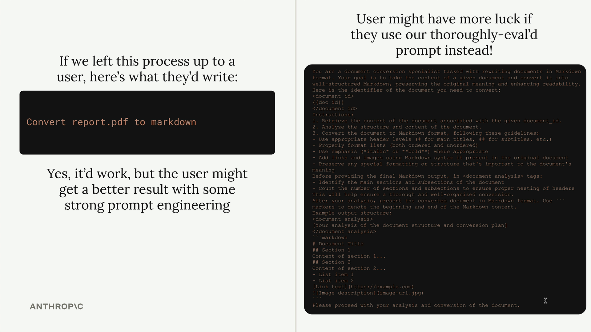
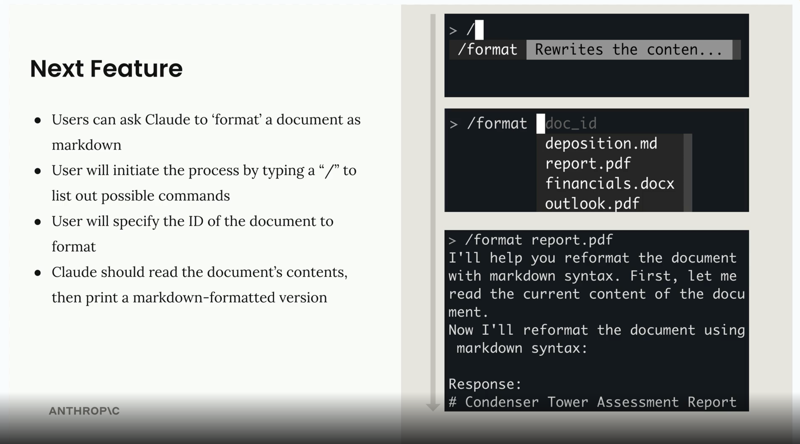

# Anthropic Courses

Site: Anthropic Courses
Link: https://anthropic.skilljar.com/introduction-to-model-context-protocol/296698

Body:

#### Summary

Prompts in MCP servers let you define pre-built, high-quality instructions that clients can use instead of writing their own prompts from scratch. Think of them as carefully crafted templates that give better results than what users might come up with on their own.


## Why Use Prompts?

Here's the key insight: users can already ask Claude to do most tasks directly. For example, a user could type "reformat the report.pdf in markdown" and get decent results. But they'll get much better results if you provide a thoroughly tested, specialized prompt that handles edge cases and follows best practices.

As the MCP server author, you can spend time crafting, testing, and evaluating prompts that work consistently across different scenarios. Users benefit from this expertise without having to become prompt engineering experts themselves.



## Building a Format Command

Let's implement a practical example: a format command that converts documents to markdown. Users will type `/format doc_id` and get back a professionally formatted markdown version of their document.

The workflow looks like this:

- User types `/` to see available commands
- They select `format` and specify a document ID
- Claude uses your pre-built prompt to read and reformat the document
- The result is clean markdown with proper headers, lists, and formatting



## Defining Prompts

Prompts use a similar decorator pattern to tools and resources:

```python
@mcp.prompt(
    name="format",
    description="Rewrites the contents of the document in Markdown format."
)
def format_document(
    doc_id: str = Field(description="Id of the document to format")
) -> list[base.Message]:
    prompt = f"""
    Your goal is to reformat a document to be written with markdown syntax.

    The id of the document you need to reformat is:
    <document_id>
    {doc_id}
    </document_id>

    Add in headers, bullet points, tables, etc as necessary. Feel free to add in structure.
    Use the 'edit_document' tool to edit the document. After the document has been reformatted...
    """

    return [
    base.UserMessage(prompt)
    ]
```

The function returns a list of messages that get sent directly to Claude. You can include multiple user and assistant messages to create more complex conversation flows.


## Testing Your Prompts

Use the MCP Inspector to test your prompts before deploying them:


The inspector shows you exactly what messages will be sent to Claude, including how variables get interpolated into your prompt template. This lets you verify the prompt looks correct before users start relying on it.

## Key Benefits

- **Consistency** - Users get reliable results every time
- **Expertise** - You can encode domain knowledge into prompts
- **Reusability** - Multiple client applications can use the same prompts
- **Maintenance** - Update prompts in one place to improve all clients

Prompts work best when they're specialized for your MCP server's domain. A document management server might have prompts for formatting, summarizing, or analyzing documents. A data analysis server might have prompts for generating reports or visualizations.

The goal is to provide prompts that are so well-crafted and tested that users prefer them over writing their own instructions from scratch.

---

Site: Anthropic Courses
Link: https://anthropic.skilljar.com/introduction-to-model-context-protocol/296692

Body:

#### Summary

The final step in building our MCP client is implementing prompt functionality. This allows us to list all available prompts from the server and retrieve specific prompts with variables filled in.

## Implementing List Prompts

The `list_prompts` method is straightforward. It calls the session's list prompts function and returns the prompts:

```
async def list_prompts(self) -> list[types.Prompt]:
result = await self.session().list_prompts()
return result.prompts
```

## Getting Individual Prompts

The `get_prompt` method is more interesting because it handles variable interpolation. When you request a prompt, you provide arguments that get passed to the prompt function as keyword arguments:

```
async def get_prompt(self, prompt_name, args: dict[str, str]):
result = await self.session().get_prompt(prompt_name, args)
return result.messages
```

For example, if your server has a `format_document` prompt that expects a `doc_id` parameter, the arguments dictionary would contain `{"doc_id": "plan.md"}`. This value gets interpolated into the prompt template.

## Testing Prompts in Action

Once implemented, you can test prompts through the CLI. When you type a slash (`/`), available prompts appear as commands. Selecting a prompt like "format" will prompt you to choose from available documents.


After selecting a document, the system sends the complete prompt to Claude. The AI receives both the formatting instructions and the document ID, then uses available tools to fetch and process the content.

## How Prompts Work

Prompts define a set of user and assistant messages that clients can use. They should be high-quality, well-tested, and relevant to your MCP server's purpose. The workflow is:


- Write and evaluate a prompt relevant to your server's functionality
- Define the prompt in your MCP server using the `@mcp.prompt` decorator
- Clients can request the prompt at any time
- Arguments provided by the client become keyword arguments in your prompt function
- The function returns formatted messages ready for the AI model

This system creates reusable, parameterized prompts that maintain consistency while allowing customization through variables. It's particularly useful for complex workflows where you want to ensure the AI receives properly structured instructions every time.
